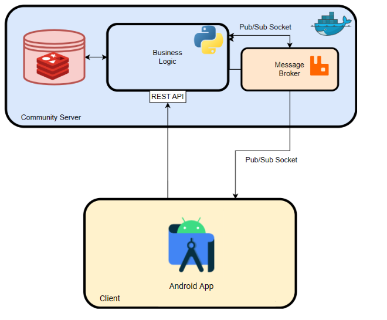
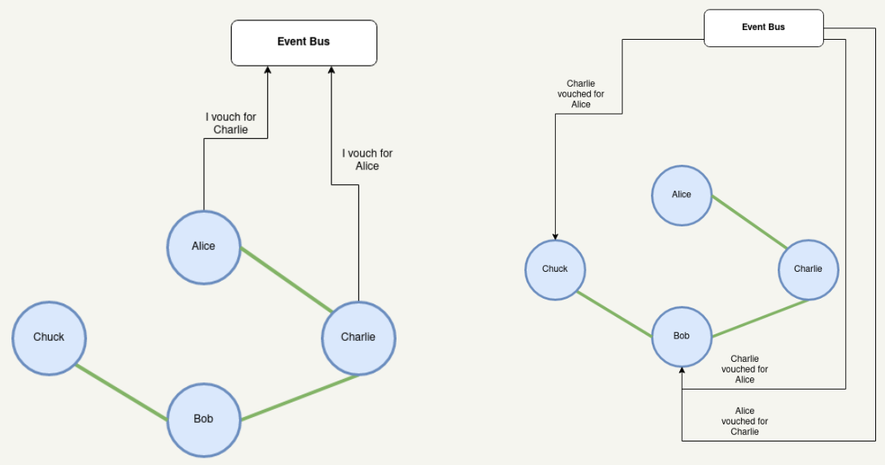
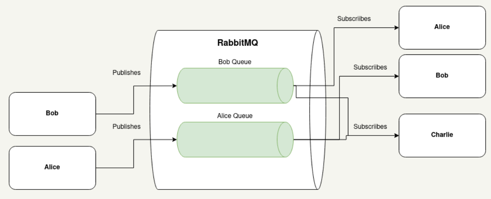
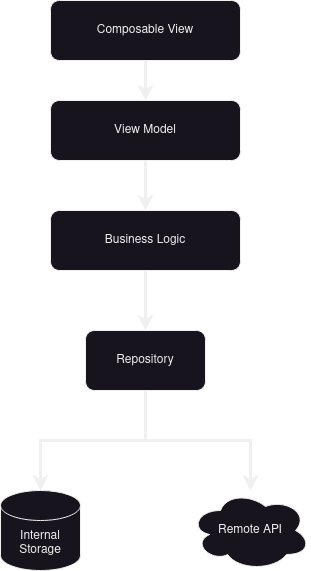
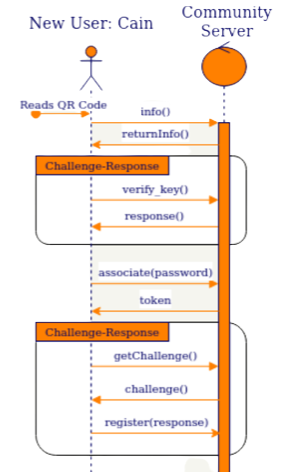

# Introduction

Many individuals and organizations, including student groups, own
physical assets that are frequently not fully utilized. These assets
hold value for acquaintances within their extended social circles who
lack ownership but require temporary use. Tools, appliances, musical
instruments, and various other physical items fall under this category.
Nonetheless, the lending process faces challenges arising from a lack of
awareness regarding the circumstances of both potential lenders and
borrowers. Moreover, assessing the reliability and trustworthiness of
borrowers presents a common apprehension in item lending.

The main goal of this project was to develop the EMPRESTA.ME platform, a
proof-of-concept system that aims to connect asset owners with
individuals in need of those items. By leveraging a distributed
architecture, the platform enhances the process of finding suitable
connections who possess the desired items. Integral to this sharing
platform is a Reputation System, built from the ground up, which
incorporates a reputation algorithm that calculates user trustworthiness
based on Vouches performed by users.

This report offers a comprehensive overview of the development process
of the EMPRESTA.ME system, covering requirements gathering, system
design and implementation. It explores the challenges and solutions
encountered throughout the project and how we handled them. By
presenting a proof-of-concept approach, this report demonstrates the
feasibility and potential of a distributed asset sharing system,
providing valuable insights for future advancements in this field and
practical applications to real-life lending scenarios

# State of the art

Our project drew inspiration from various open-source and decentralized
projects. While our solution may not resemble those projects entirely,
they provided valuable insights into addressing similar challenges. We
thoroughly analyzed each project, focusing on their pertinent aspects
that informed our approach. By examining their features and
methodologies, we gained valuable knowledge to tackle our own challenges
effectively.

## BitTorrent

BitTorrent is a communication protocol for peer-to-peer file sharing
(P2P) that allows for the distribution of files across the internet in a
decentralized matter. It contrasts with the more traditional
client-server communication model in that there is no central point of
failure.

However, BitTorrent's architecture is not fully decentralized. It is a
federated network that combines elements of the client/server and P2P
models. Users download and upload files to each other as peers, which
are deployed by trackers, central servers that support communication
between peers.

This hybrid architecture was the inspiration for our own architecture,
as we also needed to coordinate interactions between peers through a
central server.

## PGP

PGP (Pretty Good Privacy) employs a unique and powerful concept known as
the network of trust. At its core, the network of trust is a framework
that enables users to establish and verify the authenticity and
integrity of public keys used for encryption and digital signatures.

Unlike traditional centralized certification authorities, PGP's network
of trust relies on the endorsements and certifications made by
individuals within the network. By building a web of interconnected
trust relationships, users can evaluate the reliability and
trustworthiness of others in the network, fostering a decentralized and
community-driven approach to security and authentication.

This concept of using transitive trust between nodes in a network to
assign credibility was crucial to the elaboration of EMPRESTA.ME's
decentralized reputation system, VRS (Vouch Reputation System).

## Bitcoin

Bitcoin's blockchain is a decentralized, peer-to-peer distributed ledger
technology that powers the Bitcoin cryptocurrency. It consists of a
chain of blocks, each containing data (in Bitcoin's case, transaction
data). The blockchain is maintained by a network of nodes through a
consensus mechanism called Proof of Work. It ensures security,
immutability, and transparency by linking blocks using cryptographic
hashes and requiring computational effort for validation.

EMPRESTA.ME is also decentralized, so it had to include some kind of
distributed ledger, and the Bitcoin blockchain was the obvious source of
inspiration. The main drawbacks we found with the Bitcoin implementation
was the large ledger size (because each node requires a complete chain
containing all transactions) and the resource overhead of Proof of Work.

We got around these shortcomings by relaxing some requirements that are
essential for Bitcoin's needs, but not for ours. Since users do not need
to store information about those they are not interested in (unlike in
cryptocurrency scenarios), storing only useful information can greatly
reduce the size of the ledger. Similarly, as discussed in Section 6.1.1,
there was no need to use Proof of Work as a consensus mechanism, as the
issue of forgery and omission can be addressed with digital signatures
and other means. Proof of Work is only used to defend against denial of
service attacks.

## Nano

Nano's block lattice offers a distinct approach compared to Bitcoin's
blockchain. Instead of a single global blockchain, Nano utilizes a block
lattice structure where each account has its own blockchain. This
enables parallel processing of transactions, eliminating the need for
miners and enabling faster, feeless transactions. The block lattice
design enhances scalability and efficiency, making Nano an appealing
alternative to traditional blockchain systems.

As such, when designing our own distributed ledger, we made it so each
account has its own ledger for the reasons mentioned above.

# System Requirements

## Functional Requirements

The EMPRESTA.ME project aims to develop a distributed and secure asset
sharing platform. The following functional requirements outline the key
capabilities of the platform:

1.  **User Registration and Login:** Users should be able to register
    and login to the EMPRESTA.ME platform from any device. This ensures
    accessibility and convenience for participants.

2.  **Inventory Management:** Users should have the ability to add,
    remove, and edit items in their inventory. This feature allows users
    to maintain an up-to-date list of assets they are willing to share.

3.  **Vouching System:** EMPRESTA.ME should incorporate a vouching
    system where users can vouch for or against other users to establish
    trust connections. This functionality enables participants to build
    a network of trusted relationships within the platform.

4.  **Reputation Score:** Users should be able to evaluate the
    trustworthiness of other users through a reputation score. This
    score reflects the collective vouches received from the community
    and helps users make informed decisions about asset sharing. This
    reputation score should be calculated through the vouches.

5.  **Reputation Network Exploration:** EMPRESTA.ME should provide users
    with the ability to explore their reputation network. Users should
    be able to visualize the connections they have established and
    understand the trust relationships within their network.

6.  **Item Request:** Users should be able to announce their interest in
    specific items available for sharing. This feature enables users to
    express their desire to borrow or utilize certain assets from
    others.

7.  **User Profile Visualization:** Users should have the capability to
    view the profiles of connected users. This functionality allows
    participants to gather information about other users, such as their
    inventory, reputation score, and past interactions.

8.  **Community Server Hosting:** EMPRESTA.ME should provide the
    flexibility for communities to host their own community server. This
    can be accomplished by using the EMPRESTA.ME source code, a Docker
    Image, or by requesting EMPRESTA.ME's assistance in deploying the
    platform.

By fulfilling these functional requirements, the EMPRESTA.ME platform
aims to create a user-friendly, decentralized, and secure environment
for asset sharing.

## Actors & Use Cases

The target actors of the system are **individuals** seeking to borrow or
lend items within a specific community. Borrowers are individuals in
need of resources, while lenders are those willing to lend out their
items to help others and build trust. EMPRESTA.ME also targets
**communities** that aim to create a shared inventory of items.

<figure id="fig:actors">

<figcaption>Actors in this project</figcaption>
</figure>

# Architecture

The architecture we developed aims to provide solutions for both our
functional and non-functional requirements.

{#fig:example width="60%"}

As explained earlier, every user should have stored a view of the trust
topology that matches their connections and interests. Additionally,
they must be able do add new information to the topolgy through vouches
as well as verify the authenticity and integrity of incoming changes.

Our system can be comprised of several communities consisting of servers
with Flask APIs and message queues. For a user to be able to communicate
with each other, they must be associated to at least one community.

## Communication

All interactions between users are done through the REST API or the
Pub/Sub system. The API itself is built using the Flask Framework and
all business logic is done in Python. The Pub/Sub system is realized
using RabbitMQ.

It is important to note that users are not restricted to communicating
solely with peers who belong to the same community. In practice,
communities function as intermediaries for message brokering and
authentication, but they do not dictate the manner in which user
interactions take place. Users have the freedom to engage with other
users across communities without any inherent limitations. The role of
communities primarily revolves around facilitating message exchange and
providing authentication mechanisms, while the actual communication and
interaction between users remain independent of community boundaries.

## Pub/Sub System

We use RabbitMQ as a message broker, specifically leveraging the
Publish/Subscribe patterns to handle message distribution between peers.

A topic is assigned to each user in the network, which holds exclusive
publishing rights for messages [4](#fig:example2){reference-type="ref"
reference="fig:example2"}. Users utilize these topics to disseminate
various messages, such as vouches, to interested parties. Concurrently,
users have the ability to subscribe to topics belonging to other users,
enabling them to receive updates and notifications. This mechanism
facilitates targeted information distribution, allowing for an effective
communication and engagement among network participants.

In addition to expressing interest in specific participants, users may
have a requirement to receive notifications from any user within a
specified distance threshold on the trust topology. To address this, we
employ a method we call Topology Spreading
[5](#fig:example3){reference-type="ref" reference="fig:example3"}. This
process involves users recursively probing the leaf nodes in their trust
topology for neighboring nodes until the distance threshold is
surpassed. By employing this approach, users can effectively expand
their reach and ensure notifications from relevant users within the
desired proximity.

## Asynchronous Communication

Asynchronous communication is achieved by integrating a
publish/subscribe message broker and communication is over TCP sockets.
This broker allows users to get up-to-date information about the status
of connected networks of interest. A user can subscribe to multiple
channels, with each channel serving a different user on the network. In
this way, relevant information about network status can be exchanged
asynchronously and without causing significant overload.

## Persistence

The Data Access Object (DAO) layer of the community server architecture
plays a key role in handling data persistence and access to the
reputation system network. It interacts with a Redis database and acts
as a bridge between the application's business logic and the underlying
data store.

The community server also contains its own copy of the trust topology
via a Redis database. Using this database as a cache for certain
operations ensures efficient access to frequently accessed data.

The model diagram in Figure illustrates the entities and their
relationships within the DAO layer. Essentially we are storing each
currently pending authentication challenge (challenge-response
authentication), a set of all the current session tokens and an hashset
with each user's account info.

### Android Architecture

MVC - The MVC architectural pattern, widely adopted in Android
development, is designed to separate concerns and enhance code
maintainability. It divides the application into three distinct
components: the Model, View, and Controller. The Model encapsulates data
and business logic, the View represents the UI components, and the
Controller acts as the intermediary, facilitating communication between
the Model and the View. By decoupling these components, developers can
isolate functionalities, foster code reusability, and streamline future
modifications.

Repository Pattern - The repository pattern plays a vital role in
managing data access and storage within an Android application. It acts
as a middle layer between the data sources, such as databases or web
services, and the rest of the application's codebase. By abstracting the
data access logic behind a repository interface, we can achieve several
advantages. Regardless of the underlying data source, the repository
interface defines a standardized set of methods to interact with the
data. This abstraction shields the rest of the application from the
complexities of data retrieval, storage, and caching. Developers can
easily switch between different data sources, such as local databases,
remote APIs, or in-memory caches, without affecting the application's
overall functionality.

Jetpack Compose has revolutionized UI development in Android
applications. Compose is a modern toolkit that simplifies the process of
building UIs through a declarative approach. Unlike the traditional
imperative method, Compose enables developers to describe the UI state
and components using a reactive and concise syntax. This shift in
paradigm facilitates the creation of dynamic, responsive, and highly
customizable interfaces, resulting in an immersive user experience.

Combining MVC, the repository pattern, and Jetpack Compose empowers
developers to create Android applications that are scalable,
maintainable, and visually captivating. By adhering to the separation of
concerns provided by MVC, developers can build well-organized and
modular codebases. The repository pattern ensures efficient data
management, enabling seamless integration of various data sources

### Data Persistence

Data persistence is a critical aspect of Android development, as it
involves storing and retrieving data to maintain its availability across
different app sessions or device restarts. In this project Data
Persistence is handled thought:

1.  Key Storage in a Secure Storage in a Hardware Security Model
    (Android StrongBox)

2.  SQLite Database: SQLite is a lightweight relational database
    management system included with Android.

To interact SQLite databases in Android applications we are using
[Room](https://developer.android.com/training/data-storage/room), an
Android Jetpack library provided by Google. Room provides an abstraction
layer over SQLite, offering a more robust and convenient way to interact
with the database. Room incorporates the Object-Relational Mapping (ORM)
approach, allowing us to define entities (representing tables) and use
annotations to map them to corresponding database tables. It also
provides support for defining relationships between entities, enabling
the creation of more complex database structures. One of the key
benefits of using Room is its ability to generate efficient and
optimized database access code. It offers compile-time checks, ensuring
that SQL queries are validated during the build process, reducing the
chances of runtime errors. Room also provides LiveData and RxJava
integration, allowing developers to observe database changes and react
accordingly. By utilizing Room, we can leverage the power of a
relational database in their Android applications without dealing with
the complexities of raw SQL queries and database management. It promotes
cleaner code architecture and simplifies common database operations,
such as querying, inserting, updating, and deleting data.

Data Persistence is an important part of our distributed system since
there is not a centralized entity that stores information about the
Reputation System and information relevant to item announcements and
item requests. All this data is shared between users of the system and
stored in their local storage.

### Remote API

To handle communication between Android Application and the Community's
API we took advantage of Square's Retrofit Open Source Library. It
simplifies the process of creating and managing network requests,
handling responses, and processing data. Retrofit allowed us to define a
Java interface that represents your API endpoints. Retrofit also allows
integration with various serialization libraries, the one used in this
project is Google's Gson library. Retrofit also integrates well with
other libraries in the Android ecosystem, such as JetPack Compose and
Kotlin Coroutines, to handle asynchronous programming.

## Distributed Ledger Technology

A distributed ledger is a database architecture that spans multiple
interconnected computers or nodes. It offers a decentralized and
transparent system for documenting and authenticating transactions or
any digital data. In contrast to conventional centralized databases,
which grant exclusive control to a single entity, a distributed ledger
permits numerous participants to possess identical copies of the
database and attain consensus regarding its contents.

To ensure unanimous agreement among system users regarding both the
reputation system and shared network items, we drew inspiration from
Distributed Ledger Technologies. Every network node assumes the role of
preserving the system's state and storing a replicated ledger. This
ledger functions as a comprehensive record of all transactions,
including vouchers, \"lending announcements\", and user-generated
\"request messages\" exchanged among participants. In order to counter
impersonation attacks, a protective measure is implemented where the
sender signs the hashes of all messages and includes them alongside the
messages. Any signatures that are found to be invalid are subsequently
discarded. The selected cryptographic hashing algorithm employed is
SHA-256, while the signing process utilizes ECDSA with prime256v1
elliptic curve keys.

## Android Security (Android Key Store and TEE)

In order to provide a secure system we need to protect sensitive data,
prevent unauthorized access, and mitigate security risks.

The Key Store and Trusted Execution Environments (TEE) are important
security features in the Android operating system that help protect
sensitive data and ensure the integrity of critical operations.

The Android Keystore system provides a secure container for storing
cryptographic keys, making them highly resistant to extraction from the
device. Once keys are stored in the keystore, they can be utilized for
cryptographic operations while ensuring that the key material remains
non-exportable. Additionally, the keystore system offers the flexibility
to impose restrictions on key usage, such as requiring user
authentication for key access. For example, a user is required to
authenticate within the last 2 minutes in order to be able to perform
cryptographic functions.

The Android KeyStore provides the following security measures:

1.  **Extraction prevention** - The application process does not handle
    any key material. Whenever an Android Keystore key is used for
    cryptographic operations within an app, the plaintext, ciphertext,
    and messages intended for signing or verification are sent to a
    system process responsible for executing the cryptographic
    operations. In the event of a compromise to the app's process, the
    attacker main be able to perform cryptographic operations but never
    extract the key material.\
    The key material has the capability to be securely bound to the
    hardware components of an Android device, such as a Trusted
    Execution Environment (TEE)

2.  **Hardware security module** - Android Devices (depending on the API
    Level) can have a [StrongBox
    Keymaster](https://source.android.com/docs/security/features/keystore)
    or the [Trusty
    TEE](https://source.android.com/docs/security/features/trusty). The
    StrongBox hardware security module contains:

    1.  CPU

    2.  it's own Linux Kernel

    3.  Secure storage

    4.  mechanisms to resist package tampering and unauthorized

    5.  random-number generator

    6.  secure timers

    This Hardware Module supports a subset of common algorithms and key
    sizes. In this project for example we are using the 256-bit prime
    field Weierstrass curve for Elliptic Curve Keys (also known as
    prime256v1).

In this project we took all the Security Recommendations and Best
Practices defined in the Android Documentation such has securely storing
and handling cryptographic keys and cryptographic operations.

## Authentication

Individuals that utilize our system and become members of a community
must undergo an authentication process. The distributed nature of our
system entails that many users may be connected interact with many
different Community Servers. It is also important to note that some of
these communities may be intended for members of an institution or
organization, and for these communities it maybe be important to
integrate different methods of authentication.

In the development of the authentication process in our system we took
these issues into concern and tried to implement a system compatible
with multiple authentication processes and allow for interoperability
between Users and Community Server with different authentication
methods.

Communication in the authentication process is all handled with API
calls to the Community's endpoints. The process consists of 2
challenge--response authentication protocols and an association
token/passphrase.

**Challenge-Response:** The challenge-response method is an
authentication technique wherein a party presents a challenge to another
party who must respond to the challenge in order to demonstrate their
identity. The first party initiates the process by creating a random
challenge and transmitting it to the other. The entity that received the
challenge then utilizes their private key to sign the challenge and
sends the signed challenge back to the issuer. The verification occurs
when the first party validates the signature of the response with the
seconds party's public key. This protocol validates the ownership of the
public key pair for the challenged party.

Before the process begins the user must have access to the Server's
Public Key. The user can get this public key either by ready the QR-Code
issued and shared by the community or it request this information from a
public endpoint in the community's server.

1.  First Challenge-Response is used for the user to validate the
    Community Server's Public Key.

2.  Association Process. In this method, servers with different
    authentication methods can validate that a user belongs to a
    community in different ways. This can be, for example, direct
    authentication by password or it can be by transmitting an
    authorization code corresponding to an Identity Provider. This
    process yields a association session token required by some
    privileged processes.

3.  The Second Challenge-Response is used for the server to validate the
    ownership of a public key.

# Conclusion

Despite undergoing numerous modifications throughout the project, we successfully developed
a proof-of-concept that aligns with the initial essential requirements. However, it is crucial to
note that the system necessitates additional deliberation and is not currently ready for release
as a marketable product. Nonetheless, the proof-of-concept offers valuable insights into the
potential and benefits of incorporating compact and secure distributed systems within communal
environments. The application’s emphasis on security and privacy safeguards user data and
transactions, instilling confidence in the system. As we move towards a more collaborative
and resource-efficient future, this innovative application paves the way for the establishment of
thriving sharing economy