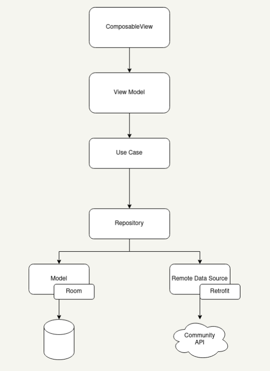

# AndroidApp
EMPRESTA.ME Android Application

# Project Info

* Project Utilizes Jetpack Compose.
* MVVM + Repository pattern
* Dependency Injection DaggerHilt 
* Room Databse

#

* Reusable UI components are located under UI folder
* Navigation Components are located under the Navigation folder
* Dependency Injection and Repository pattern code are under the DI folder. Dependency Injection is achieved with Dagger Hilt. Please se the [Android Documentation about the subject](https://developer.android.com/training/dependency-injection/hilt-android) (it is very good)
* Room database and data access object classes are located under the DAO folder
* Components related to accessing API's are under the RemoteAPI Folder

# 
### Features
* **Busines Logic**
  * Located under the use_case folder in each feature folder
* **View and Composable Screens**
  * View Models and Composable Screens are located under each feature folder
  * **View Model**: It exposes state to the UI and encapsulates related business logic. Its principal advantage is that it caches state and persists it through configuration changes. This means that your UI doesn’t have to fetch data again when navigating between activities, or following configuration changes

# How to Run the Aplication

Have Android Studio Installed.  

When running the aplication make sure to Register when entering the applicatio. (just feel in the username)

# PUB SUB
The Pub Sub System can be described given some characteristics:
- **Every user having is own "**exchange**"** of messages named after his public key in rabbitmq.
- Every time he does a important action that **action is published in is own "**exchange**"** as a **message** of some type (ex. Vouch Message).
- Every time someone joins your network and is in your **interest range** you will **subscribe to its "**exchange**"**
- Every time you are on the app you are connected to the rabbitmq and listening to all your subscriptions (people you are interested in)
- Every time you receive a message your phone will **handle the rabbitmq message acordingly** to what type it is.

# Rabbit MQ
- Each community server has a rabbitmq server running as well; this rabbitmq will be responsible for keeping a **exchange** for each member of the community.
- Because a user can be a member of many communities, he will need to publish his actions to every exchange (in every community).
- Most of the Pub Sub logic will occur on the frontend side, not on the backend.

# Messages
The PubSub messages need to be handled in different levels depending on their type; for example, a Vouch message needs to be handled by the server when it is published and also by every user after it is received while he is listening.

So in this section, it will be described the messages, what their purpose is, and how they will be handled.

## **Vouch Message**
Consists in (header, state, clock, sender, receiver, message, nonce, signature)

It serves to update the network, using them both the  server and the user's phone should be able to construct the full trust network.

**Server**

Handling steps:
- Validation -> Check the nonce (ask bruno if you dont know what this one means)
- Validation -> Check the sender (see if it is involved in the vouch)
- Validation -> Check the signature (u know how signatures work)
- Treatment -> Save the message in a persistent list of Vouch Messages (needs to save the all messages of every relation)
- Treatment -> Add the new vouch information to the in memory static variable matrix

This matrix variable its sopposed to be a n by n matrix (n=people in your network) representing the votes between everyone (0=no vote, 1 = positive, 2 = negative)

**User's Phone** 

Handling steps:

- Validation -> Check the nonce (ask bruno if you dont know what this one means)
- Validation -> Check the sender (see if it is involved in the vouch)
- Validation -> Check the signature (u know how signatures work)
- Treatment -> Save the message in a persistent list of Vouch Messages (only needs to save the latest message of x relation)
- Treatment -> Add the new vouch information to the in memory static variable matrix

This matrix variable its sopposed to be a n by n matrix (n=people in your network) representing the votes between everyone (0=no vote, 1 = positive, 2 = negative)
 

# System
The Pub Sub System can be described given some characteristics:
- **Every user having is own "**exchange**"** of messages named after his public key in rabbitmq.
- Every time he does a important action that **action is published in is own "**exchange**"** as a **message** of some type (ex. Vouch Message).
- Every time someone joins your network and is in your **interest range** you will **subscribe to its "**exchange**"**
- Every time you are on the app you are connected to the rabbitmq and listening to all your subscriptions (people you are interested in)
- Every time you receive a message your phone will **handle the rabbitmq message acordingly** to what type it is.

# Rabbit MQ
- Each community server has a rabbitmq server running as well; this rabbitmq will be responsible for keeping a **exchange** for each member of the community.
- Because a user can be a member of many communities, he will need to publish his actions to every exchange (in every community).
- Most of the Pub Sub logic will occur on the frontend side, not on the backend.

# Messages
The PubSub messages need to be handled in different levels depending on their type; for example, a Vouch message needs to be handled by the server when it is published and also by every user after it is received while he is listening.

So in this section, it will be described the messages, what their purpose is, and how they will be handled.

## **Vouch Message**
Consists in (header, state, clock, sender, receiver, message, nonce, signature)

It serves to update the network, using them both the  server and the user's phone should be able to construct the full trust network.

**Server**

Handling steps:
- Validation -> Check the nonce (ask bruno if you dont know what this one means)
- Validation -> Check the sender (see if it is involved in the vouch)
- Validation -> Check the signature (u know how signatures work)
- Treatment -> Save the message in a persistent list of Vouch Messages (needs to save the all messages of every relation)
- Treatment -> Add the new vouch information to the in memory static variable matrix

This matrix variable its sopposed to be a n by n matrix (n=people in your network) representing the votes between everyone (0=no vote, 1 = positive, 2 = negative)

**User's Phone** 

Handling steps:

- Validation -> Check the nonce (ask bruno if you dont know what this one means)
- Validation -> Check the sender (see if it is involved in the vouch)
- Validation -> Check the signature (u know how signatures work)
- Treatment -> Save the message in a persistent list of Vouch Messages (only needs to save the latest message of x relation)
- Treatment -> Add the new vouch information to the in memory static variable matrix

This matrix variable its sopposed to be a n by n matrix (n=people in your network) representing the votes between everyone (0=no vote, 1 = positive, 2 = negative)

## **X Message**
